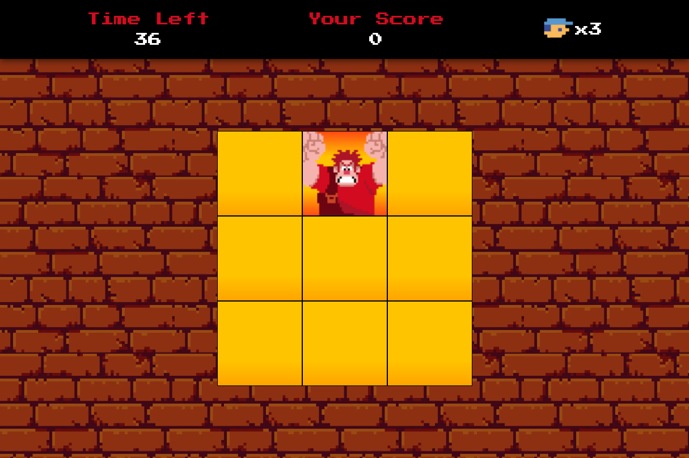

# Detona Ralph JS Game

Projeto de jogo inspirado no filme "Detona Ralph", desenvolvido durante bootcamp da DIO com HTML, CSS e JavaScript. Clique [aqui](https://brunaeloisa.github.io/detona-ralph-js/) para jogar.

## Como jogar

O objetivo do jogo é clicar na figura do Ralph que se movimenta pela malha o máximo de vezes possível até que o tempo acabe.

### Modo fácil

Nesse modo, o inimigo aparece aleatoriamente pela malha em intervalos fixos de tempo e você deve clicar no quadrado correspondente para eliminá-lo. Cada clique em um quadrado vazio custará uma vida. Três erros encerram o jogo.

### Modo difícil

Com um tempo inicial de apenas 10 segundos, você deverá ter agilidade para prolongar a sua permanência no jogo e conquistar ainda mais pontos. Mas fique atento, pois você será penalizado sempre que deixar passar algum inimigo.

- A cada 20 pontos obtidos você receberá 10 segundos adicionais;
- Um novo inimigo surgirá automaticamente após cada clique correto;
- Para cada inimigo não atingido será descontado 1 segundo do seu tempo.